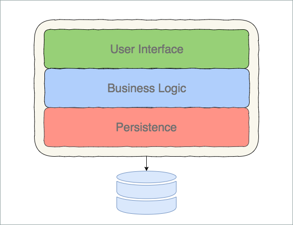
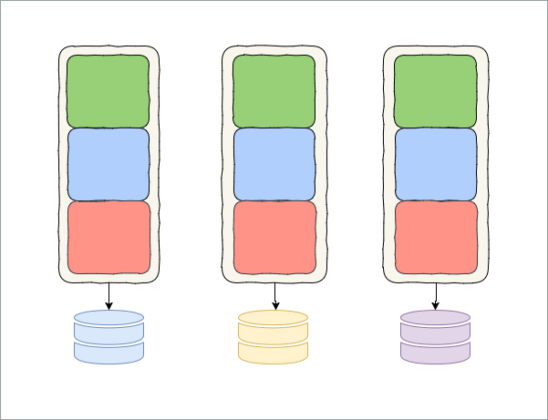
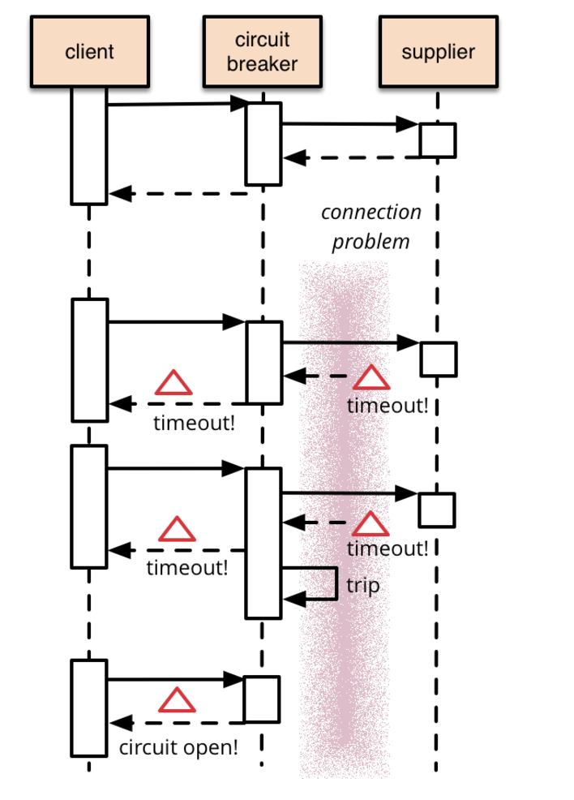

- title : Building microservices with F#
- description : A journey into the microservice world with F#, Net Core and Docker
- author : Alexander Mogilka
- theme : moon
- transition : default

***
## Building microservices with F#
#### A journey into the microservice world with F#, Net Core and Docker
 
Alexander Mogilka
 
[@alxmglk](http://www.twitter.com/alxmglk)

***
## Let's start with a monolith

---
## Limitations and possible issues

* it’s difficult to distribute responsibility across the team members and manage release cycle as project and team size grow
* you ought to retest the entire system even if you did only a small change
* it's not possible to scale the system efficiently
* increased fragility since error in a single module might kill the entire system

---
## But the monolith is a good way to start out!
[Monolith First](https://martinfowler.com/bliki/MonolithFirst.html)

***
## Microservices to the rescue

#### Small autonomous services that work together

---
## Benefits of the microservices
* idependent release cycle of each service which ensures more lightweight deployments
* drastically improved scalability
* freedom to choose the tech stack suitable for particular task

---
## How about challenges?
### Welcome to <strike>hell</strike> the world of distributed systems
* everything fails all the time
* additional overhead of the remote calls
* maintain outbound contracts of the microservices
* increased operational costs

***
## Minimaze the impact of failures
* eliminate synchronous calls
* fail fast
* retries

---
## Synchronous calls are pure evil
The presence of synchronous calls multiplies the impact on consumers in case of timeouts and failures

---
## Circuit breaker

[https://martinfowler.com/bliki/CircuitBreaker.html](https://martinfowler.com/bliki/CircuitBreaker.html)

---
## It's easy to address cross-cutting concerns in F#
    type AsyncArrow<'a,'b> = 'a -> Async<'b>  

***
## Make failures discoverable
* collect and aggregate logs
    * don't forget about correlation ids
* collect and aggregate metrics
* monitoring

---
## Samples in F#

***
## Consumer first
* strangler pattern for evolving API
* Postel's law
* write consumer tests on the API and run them on each check in of the producer
* avoid non-explicit serialization

***
## Embrace the culture of automation
* each microservice describes its own build/deploy pipeline
    * Jenkins Pipeline + Blue Ocean plugins + Jenkinsfile
* containerization and clusterization
* dashboard for monitoring the microservices
* 

***
## Why F# is great for the microservices?

TL;DR - it reduces the overall complexity and thus simplifies your life

***
## Null is a pure evil
Try to escape from the world of nulls into the functional world of options as soon as possible

<small data-markdown>
[Null References: The Billion Dollar Mistake](https://www.infoq.com/presentations/Null-References-The-Billion-Dollar-Mistake-Tony-Hoare)
</small>

---
## Null checks vs options
    // Explicit null check
    let toInt (value : string) =
        if (value <> null) then
            Int32.Parse value |> Some
        else
            None
    
    // World of options
    let toInt (value : string) =
        value |> Option.ofObj |> Option.map Int32.Parse
---
## A world without null checks
* the execution flow is streamlined
* no implicit assumptions regarding the meaning of null
* no need to care about null checks

***
## Ease of domain modeling
By leveraging the algebraic data types you could easily build a rich self-describing domain model and make illegal states irrepresentable

<small data-markdown>
[The "Designing with types" series](https://fsharpforfunandprofit.com/series/designing-with-types.html)
</small>

---
## Example of a model

    type ContactInfo = 
    | EmailOnly of EmailContactInfo
    | PostOnly of PostalContactInfo
    | EmailAndPost of EmailContactInfo * PostalContactInfo

    type Contact = {
        Name: Name
        ContactInfo: ContactInfo
    }

***
## Rich set of compile-time checks

    type Command = 
    | Create of string
    | Deactivate    
    | Rename of string

    let handle id = function
    | Create name -> isValidName name <?> create
    | Deactivate -> isInactive id <?> deactivate
    | Rename name ->  isValidName name <?> rename

***
## Agility of the functional architecture
You can easily adjust the execution flow and address cross-cutting concerns without affecting the core domain logic as long as you get along with functional architecture

<small data-markdown>
[Functional architecture is ports and adapters](http://blog.ploeh.dk/2016/03/18/functional-architecture-is-ports-and-adapters/)
</small>

---
## Example

***
## A number of idiomatic patterns for modelling interservice communication
* AsyncArrow
* AsyncSeq

***
## Conclusions
* Microservices architecture give you a lot of perks but in the same time require a decent level of expertise for the team members
* F# is great for the microservices, certainly much better than traditional OOP languages

***
## Questions?