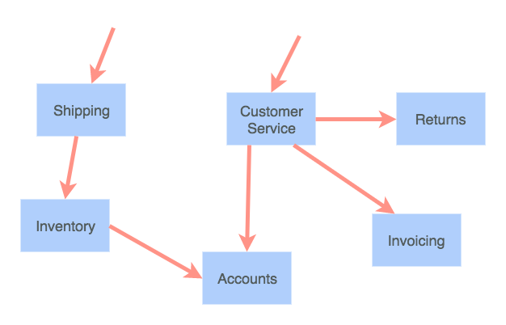

- title : Building microservices with F#
- description : A journey into the microservice world with F#, Net Core and Docker
- author : Alexander Mogilka
- theme : moon
- transition : default

***
## Building microservices with F#
#### A journey into the microservice world with F#, Net Core and Docker
 
Alexander Mogilka
 
[@alxmglk](http://www.twitter.com/alxmglk)

***
## Microservices to the rescue

<small>Small autonomous services that work together and modelled around a business domain</small>

---
## Benefits of the microservices
* independent release cycle of each service
* failures are isolated
* granular scaling
* freedom to choose the tech stack

---
## How about challenges?
* everything fails all the time
* additional overhead of the remote calls
* take care of the inter-microservice contracts
* increased operational costs

---
## Welcome to <strike>hell</strike> the world of distributed systems

***
## We cannot eliminate failures but we can minimize the impact

***
## Synchronous calls are pure evil
A bunch of parallel synchronous calls will suddenly exhaust the thread pool

---
## Writing async code in F# is a piece of cake
    // MerchantId -> Async<MerchantDiscount>
    let getMerchantDiscount merchantId = ...
    // ProductId -> MerchantDiscount -> Async<ProductPrice>
    let getProductPrice productId discount = ...

    // 1st approach : async workflow
    // Async<ProductPrice>
    async {
        // MerchantDiscount
        let! discount = getMerchantDiscount merchantId
        return! getProductPrice productId discount
    }
    // 2nd approach: more idiomatic way
    // MerchantId -> Async<ProductPrice>
    getMerchantDiscount >> Async.bind (getProductPrice productId)

***
## Fail fast
Slow failures propagate from the dependencies up to the consumers

---
## Circuit breaker

[https://martinfowler.com/bliki/CircuitBreaker.html](https://martinfowler.com/bliki/CircuitBreaker.html)

---
## Circuit breaker and retries in the wild
    type AsyncArrow<'a,'b> = 'a -> Async<'b>
    
    // AsyncArrow<Guid, HttpResponseMessage>
    let getProductPrice productId = ...

    // AsyncArrow<Guid, HttpResponseMessage> - the signature is still the same
    let execute = 
        getProductPrice
        |> AsyncArrow.after (updateInvoice invoice)
        |> AsyncArrow.retry retryCount backoffStrategy
        |> AsyncArrow.circuitBreaker circuitBreakerPolicy

***
## Make failures discoverable
* collect and aggregate logs with metrics
    * don't forget about correlation ids
* monitoring

---
## Seamless incorporation of the logging
    let logStart _ = log.Info "Import started"
    let logFinish _ _ = log.Info "Import finished"
    let logError ex = 
        sprintf "An error has occured during the import: %s" ex.Message 
        |> log.Error 

    importProducts
    |> updateInventory
    |> AsyncArrow.before logStart
    |> AsyncArrow.after logFinish
    |> AsyncArrow.onError logError

---
## Correlation Ids

---
## Inject correlation id into the service request
    // HttpRequestMessage -> Async<HttpResponseMessage>
    let makeHttpRequest = ...

    // HttpRequestMessage -> HttpRequestMessage
    let injectCorrelationId correlationId (req : HttpRequestMessage) =
        req.Headers.Add ("Correlation-Id", correlationId)
        req

    // HttpRequestMessage -> Async<HttpResponseMessage>
    let makeHttpRequestWithCorrelationId = 
        makeHttpRequest 
        |> AsyncArrow.mapIn (injectCorrelationId correlationId)

***
## Functional composition is sweet

Due to the rich capabilities of functional composition you could easily address cross-cutting concerns like retries, timeouts, logging etc without any changes to your business logic

***
## Microservice API management
* adhere to the Postel's law
* write consumer tests on the API and run them on each check in of the producer
* document your API (Swagger)

---
## Explicit serialization
     type User = {
        Id : Guid
        Name : string
    }
    with
        static member ToJson(x : User) =
            seq {
                yield "id" .= x.Id
                yield "name" .= x.Name
            } |> jobj

        static member FromJson(json : JsonValue) =
            jsonParse {
                // .@ : JsonValue<'A>; id : Guid
                let! id = json .@ "id"
                let! name = json .@? "name"

                return { Id = id; Name = name }
            }

***
## Demo

#### F# / .Net Core / Docker / vsdbg
[https://github.com/alxmglk/kafka-fsharp-sample](https://github.com/alxmglk/kafka-fsharp-sample)

***
## Conclusion
* Microservices architecture provides a lot of benefits but at the same time requires you to adopt a number of advanced practices
* F# and functional paradigm work perfect for the microservices, especially in comparison to the object-oriented languages

***
## Questions?

***
## Useful links
* https://martinfowler.com/articles/microservices.html
* https://youtu.be/PFQnNFe27kU
* https://troykershaw.com/the-asyncarrow
* https://monkey.org/~marius/funsrv.pdf
* https://martinfowler.com/bliki/TolerantReader.html